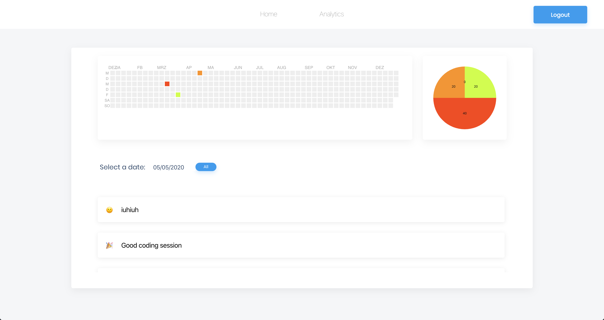

## Project Name & Pitch

Mood-Tracker:

An application that allows you to track your daily mood. You can see your moods within a calender chart and filter for specific days.

## Project Status

This project is currently in development. This project was created for module assessments at the CODE University of Applied Sciences. 

## Installation and Setup Instructions
 
Clone down this repository. You will need `node` and `npm` installed globally on your machine.  

Installation:

`npm install`  

To Run Test Suite:  

`npm test`  

To Start Server:

`npm start`  

To Visit App:

`localhost:3000/` 

## Project Screen Shot(s)

### Architecture:

### Mood Page:

### Analytics Page:

 

